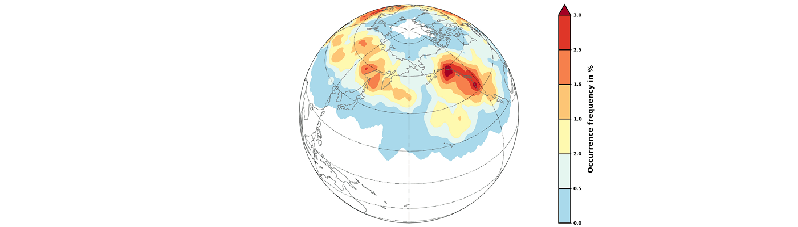

.. image:: https://img.shields.io/pypi/v/wavebreaking.svg
        :target: https://pypi.python.org/pypi/wavebreaking
        
.. image:: https://img.shields.io/github/license/skaderli/wavebreaking
        :target: https://github.com/skaderli/wavebreaking/blob/master/LICENSE
        :alt: License
        
.. image:: https://readthedocs.org/projects/wavebreaking/badge/?version=latest
        :target: https://wavebreaking.readthedocs.io/en/latest/?version=latest
        :alt: Documentation Status

============
WaveBreaking - Detection, Classification and Tracking of Rossby Wave Breaking
============

    
WaveBreaking is a python package that provides detection, classification and tracking of Rossby Wave Breaking (RWB) in weather and climate data. The detection of RWB is based on analyzing the dynamical tropopause represented by a closed contour line encircling the pole as for example in Potential Vorticity (PV) fields. By applying three different breaking indices, regions of RWB are identified and different characteristics of the breaking events such as area and intensity are calculated. The tracking routine provides information about the temporal evolution of the wave breaking events. Finally, the implemented plotting methods allow for a first visualization. 

The detection of RWB is based on applying a wave breaking index to the dynamical tropopause. The WaveBreaking package provides to different RWB indices:

* **Streamer Index:** The streamer index is based on work by `Wernli and Sprenger (2007)`_ (and `Sprenger et al. 2017`_). Streamers are elongated structures present on the contour line the represents the dynamical tropopause. They can be described by a pair of contour points that are close together in their geographical distance but far apart in their distance connecting the points on the contour. Further description can be found in my `master thesis <https://occrdata.unibe.ch/students/theses/msc/406.pdf>`_.

* **Overturning Index:** The overturning index is based on work by `Barnes and Hartmann (2012)`_. This index identifies overturning structures of the contour line that represents the dynamical tropopause. An overturning of the contour line is present if the contour intersects at least three times with the same longitude. Further description can be found in my `master thesis <https://occrdata.unibe.ch/students/theses/msc/406.pdf>`_.

* **Cutoff Index:** The Cutoff Index provides information about the decaying of a wave breaking event. From a Potential Vorticity perspective, a wave breaking event is formed by an elongation of the 2 PVU contour line. These so-called streamers can elongate further until they separate from the main stratospheric or tropospheric body. The separated structure is referred to as a cutoff (`Wernli and Sprenger (2007)`_.

.. _`Wernli and Sprenger (2007)`: https://journals.ametsoc.org/view/journals/atsc/64/5/jas3912.1.xml
.. _`Sprenger et al. 2017`: https://journals.ametsoc.org/view/journals/bams/98/8/bams-d-15-00299.1.xml
.. _`Barnes and Hartmann (2012)`: https://agupubs.onlinelibrary.wiley.com/doi/full/10.1029/2012JD017469

The tool is designed to analyze gridded data provided as an `xarray.DataArray <https://docs.xarray.dev/en/stable/generated/xarray.DataArray.html>`_. Output is provided either in a `geopandas.GeoDataFrame <https://geopandas.org/en/stable/docs/reference/api/geopandas.GeoDataFrame.html>`_ or in an `xarray.DataArray <https://docs.xarray.dev/en/stable/generated/xarray.DataArray.html>`_.

The class structure and parts of the tracking routines are based on the `ConTrack - Contour Tracking <https://github.com/steidani/ConTrack>`_ tool developed by `Daniel Steinfeld <https://github.com/steidani>`_. 

Important information:
-----------------

* The package is still under construction and therefore, major errors could occur. 
* Free software: MIT license
* Further documentation about the implemented methods can be found in my `master thesis <https://occrdata.unibe.ch/students/theses/msc/406.pdf>`_

Installation
--------

Stable release
~~~~~~~~
To install WaveBreaking, run this command in your terminal:
 
..  code-block:: 

        pip install wavebreaking ### NOT AVAILABLE YET

This is the preferred method to install WaveBreaking, as it will always install the most recent stable release. 
Your virtual environment is automatically checked for the necessary dependencies. 
After the installation, you can start calculating wave breaking events by following the tutorial.

From sources
~~~~~~~~

The sources for WaveBreaking can be downloaded in two different ways. You can either install WaveBreaking directly from the GitHub repository:

..  code-block:: 

        pip install git+https://github.com/skaderli/WaveBreaking

Or you can clone the GitHub repository first and then install WaveBreaking locally. First, set the working directory and clone the repository.

..  code-block:: 

        cd /path/to/local/workspace
        git clone https://github.com/skaderli/WaveBreaking.git

Second, set up the conda environment and install the necessary dependencies:

..  code-block:: 

        conda create -y -n wb_env
        conda env update -f environment.yml -n wb_env

Now the environment can be activated and the WaveBreaking package can be locally installed by using the developer mode “-e”:

.. code-block::

        conda activate wb_env
        pip install -e .

To check if the installation was successful, some tests can be performed:

.. code-block::
 
        python -m unittest tests.test_wavebreaking
        

Tutorial
--------

This tutorial shows how to calculate Rossby wave breaking events step by step. After successfully installing WaveBreaking, the module needs to be imported. Make sure that the Python kernel with the correct virtual environment (where WaveBreaking is installed) is running.

.. code-block:: python

        import wavebreaking as wb
   
        
Data pre-processing:
~~~~~~~~~~       

Optionally, the variable intended for the wave breaking calculations can be smoothed. The smoothing routine applies a 5-point smoothing (not diagonally) with a double-weighted center and an adjustable number of smoothing passes. This routine returnes a xarray.DataArray with the variable "smooth_variable". 

.. code-block:: python

        #read your data
        import xarray as xr
        demo_data = xr.open_dataset("tests/tests_data/test_data.nc")

        #smooth variable with 5 passes
        smoothed = wb.calculate_smoothed_field(data = demo_data.variable, 
                                                      passes = 5)
        
        
The wavebreaking module can calculate the intensity for each identified event. For that, the intensity field needs to be provided or calculated before the event identification. Here, the momentum flux derived from the product of the (daily) zonal deviations of both wind components is used as the intensity. This routine creates a xarray.DataArray with the variable "mflux". More information can be found in my `master thesis <https://occrdata.unibe.ch/students/theses/msc/406.pdf>`_.

.. code-block:: python

        #calculate momentum flux (wind data not included in the demo data)
        mflux = wb.calculate_momentum_flux(u = demo_data.variable, 
                                           v = demo_data.variable)
        
                                   
Contour calculation:
~~~~~~~~~~
       
Both Rossby wave breaking indices are based on a contour line representing the dynamical tropopause. The "get_contours()" function calculates the dynamical tropopause on a specific level (commonly the 2 PVU level for Potential Vorticity). If the input field is periodic, the parameter "periodic_add" can be used to extend the field in the longitudinal direction (default 120 degrees) to correctly extract the contour at the date border. With "original_coordinates = False", array indices are returned (used for the index calculations), instead of original coordinates. This routines returns a geopandas.GeoDataFrame with a geometry column and some properties for each contour. 

.. code-block:: python

        #calculate contours
        contours = wb.get_contours(data = smoothed, 
                                   contour_level = 2, 
                                   periodic_add = 120, 
                                   original_coordinates = True)
        

Index calculation:
~~~~~~~~~~

All three RWB indices perform the contour calculation before identifying the RWB events. For the streamer index, the default parameters are taken from `Wernli and Sprenger (2007)`_ (and `Sprenger et al. 2017`_) and for the overturning index from `Barnes and Hartmann (2012)`_. All index functions create a geopandas.GeoDataFrame with a geometry column and some properties for each event. 

.. code-block:: python

        #calculate streamers
        streamers = wb.calculate_streamers(data = smoothed, 
                                           contour_level = 2, 
                                           geo_dis = 800,
                                           cont_dis = 1200,
                                           intensity = mflux,
                                           periodic_add = 120)
                            
.. code-block:: python                  

        #calculate overturnings
        overturnings = wb.calculate_overturnings(data = smoothed, 
                                                 contour_level = 2, 
                                                 range_group = 500, 
                                                 min_exp = 5, 
                                                 intensity = mflux,
                                                 periodic_add = 120)
        
.. code-block:: python
 
        #calculate cutoffs
        cutoffs = wb.calculate_cutoffs(data = smoothed, 
                                       contour_level = 2,
                                       min_exp = 5,
                                       intensity = mflux, 
                                       periodic_add = 120)

Transform to xarray.DataArray:
~~~~~~~~~~

To calculate and visualize the occurrence of Rossby wave breaking, it comes in handy to transform the coordinates of the events into a xarray.DataArray. The "to_xarray" function flags every grid cell where an event is present with the value 1. Before the transformation, it is suggested to filter the geopandas.GeoDataFrame for the desired events (e.g., stratospheric events with Potential Vorticity values larger than 2 PVU).

.. code-block:: python

        #filter events
        f_events = streamers[streamers.mean_var >= 2]
        
        #transform to xarray.DataArray
        flag_array = wb.to_xarray(data = smoothed, #data used for the index calculation (to receive the same dimensions)
                                  events = f_events)

        
Visualization: 
~~~~~~~~~~

WaveBreaking provides two options to do a first visual analysis of the output. Both options are based on the xarray.DataArray with the flagged grid cells from the "to_xarray" function. 

To analyze a specific large scale situation, the wave breaking events on a single time steps can be plotted:

.. code-block:: python

        #import cartopy for projection
        import cartopy.crs as ccrs
        
        wb.plot_step(flag_data = flag_array, 
                     data = smoothed, 
                     step = "1979-06-18", #index or date (this date is not in the demo data)
                     contour_level = [2],
                     proj = ccrs.NorthPolarStereo(), #cartopy projection, optional
                     size = (12,8), 
                     periodic = True, 
                     labels = True,
                     levels = None, 
                     cmap = "Blues",
                     color_events = "gold", 
                     title = "")

.. image:: docs/figures/plot_step.png
    :alt: plot step 
    
The analyze Rossby wave breaking from a climatological perspective, the occurrence (for specific seasons) can be plotted:

.. code-block:: python

        wb.plot_clim(flag_data = flag_array, 
                     seasons = None,
                     proj = ccrs.NorthPolarStereo(), #cartopy projection, optional
                     size = (12,8), 
                     smooth_passes = 0,
                     periodic = True, 
                     labels = True,
                     levels = None, 
                     cmap = None, 
                     title = "")

.. image:: docs/figures/plot_climatology.png
    :alt: plot climatology 
    
Event tracking:
~~~~~~~~~~~

Last but not least, the wave breaking module provides a routine to track events over time. Events that overlap between two time steps receive the same label. Again, it is suggested to filter the events first. This routine adds a column "label" to the events geopandas.GeoDataFrame.

.. code-block:: python

        #filter events
        f_events = streamers[streamers.mean_var >= 2][::2] #use every second event for clarity

        #track events
        wb.event_tracking(events = f_events, 
                          time_range = 24) #time range for temporal tracking in hours

The result can be visualized by plotting the paths of the tracked events:

.. code-block:: python
        
        wb.plot_tracks(data = smoothed, #data used for the index calculation 
                       events = f_events,  
                       proj = ccrs.NorthPolarStereo(), #cartopy projection, optional
                       size = (12,8),
                       min_path = 0, #minimal number of paths
                       plot_events = False, #plot events as grey shaded area
                       labels = True,
                       title = "")
                       
.. image:: docs/figures/plot_tracks.png
    :alt: plot tracks

Credits
-------

* The installation guide is to some extend based on the `ConTrack - Contour Tracking <https://github.com/steidani/ConTrack>`_ tool developed by `Daniel Steinfeld <https://github.com/steidani>`_. 

* This package was created with Cookiecutter_ and the `audreyr/cookiecutter-pypackage`_ project template.

.. _Cookiecutter: https://github.com/audreyr/cookiecutter
.. _`audreyr/cookiecutter-pypackage`: https://github.com/audreyr/cookiecutter-pypackage
