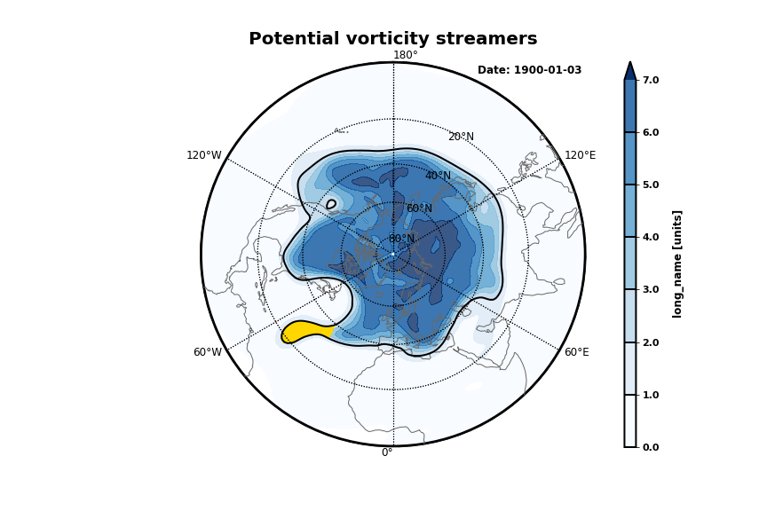
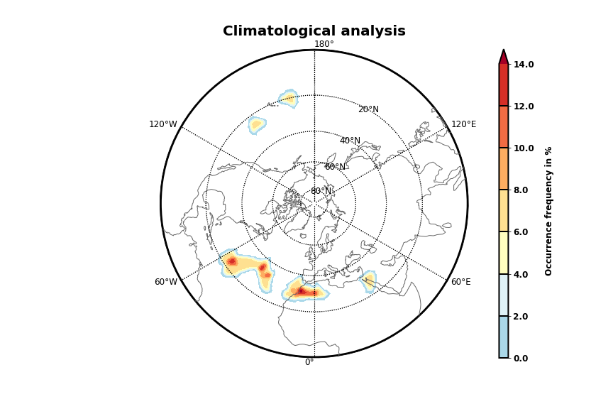
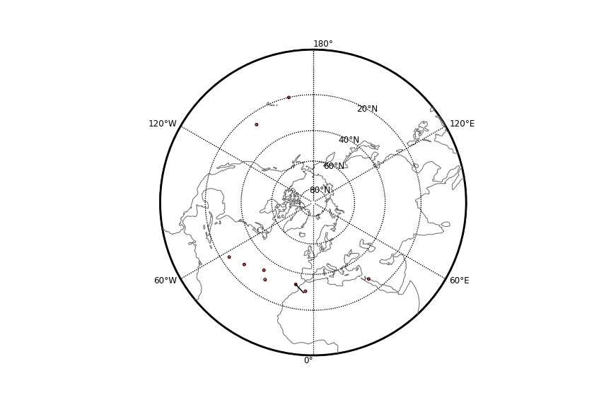

=====
Tutorial
=====
This tutorial shows how to calculate Rossby wave breaking events step by step. After successfully installing the wavebreaking package, the wavebreaking module needs to be imported. Make sure that the Python kernel with the correct virtual environment (where the wavebreaking package is installed) is running.

.. code-block:: python

        from wavebreaking import wavebreaking
        
Read data:
----------

Input data is only accepted in a NetCDF-file with two spatial and one temporal dimension. There are two options to read data: Either directly as a NetCDF-file or as a xarray.Dataset: 

.. code-block:: python

        #input ERA5 data for demonstration from 1979-06-01 to 1979-08-31 
        #the data can be downloaded from https://cds.climate.copernicus.eu
        import xarray as xr
        file = "docs/demo_data/demo_data.nc"
        ds = xr.open_dataset(file)

        #initiate wavebreaking class and read data
        wb = wavebreaking(file) #or
        wb = wavebreaking(ds)
        
        #data can also be read in explicitly
        wb = wavebreaking()
        wb.read(file) #or
        wb.read_xarray(ds)
        
Data pre-processing:
----------     

Optionally, the variable intended for the wave breaking calculations can be smoothed. The smoothing routine applies a 5-point smoothing (not diagonally) with a double-weighted center and an adjustable number of smoothing passes. This routine creates a xarray.DataArray with the variable "smooth_variable". 

.. code-block:: python

        #smooth variable with 5 passes
        wb.calculate_smoothed_field("pv", passes = 5)
        
        #access xarray.DataArray
        wb["smooth_pv"]
        
The wavebreaking module can calculate the intensity for each identified event. For that, the intensity field needs to be calculated before the event identification. Here, the momentum flux derived from the product of the (daily) zonal deviations of both wind components is used as the intensity. This routine creates a xarray.DataArray with the variable "mflux". More information can be found in my `master thesis <https://occrdata.unibe.ch/students/theses/msc/406.pdf>`_. If the momentum flux is not calculated, the intensity of the events is not provided.

.. code-block:: python

        #calculate momentum flux (wind data not included in the demo data)
        wb.calculate_momentum_flux(variable_zonal = "zonal", variable_meridional = "meridional", dtime = "1D")
        
        #access xarray.DataArray
        wb["mflux"]
                                   
Contour calculation:
----------
       
Both Rossby wave breaking indices are based on a contour line representing the dynamical tropopause. The "get_contours()" function calculates the dynamical tropopause on a specific level (commonly the 2 PVU level for Potential Vorticity). If the input field is periodic, the parameter "periodic_add" can be used to extend the field in the longitudinal direction (default 120 degrees) to correctly extract the contour at the date border. This routines creates a pandas.DataFrame with the coordinates and some properties of the contour line.

.. code-block:: python

        #calculate contours
        wb.get_contours(variable = "smooth_pv", level = 2, periodic_add = 120)
        
        #access pandas.DataFrame
        wb.contours 
        

Index calculation:
----------

Now the index calculation can be performed based on the identified contour lines. For the streamer index, the default parameters are taken from `Wernli and Sprenger (2007)`_ (and `Sprenger et al. 2017`_) and for the overturning index from `Barnes and Hartmann (2012)`_. All index functions create a pd.DataFrame with the coordinates and some properties of the events.

.. code-block:: python

        #calculate events
        wb.get_streamers(geo_dis = 800, cont_dis = 1500)
        wb.get_overturnings(range_group = 500, min_exp = 5)
        wb.get_cutoffs(min_exp = 5)
        
        #access pandas.DataFrame
        wb.streamers
        wb.overturnings
        wb.cutoffs

Transform to Dataset:
----------

To calculate and visualize the occurrence of Rossby wave breaking, it comes in handy to transform the coordinates of the events into a xarray.Dataset. The "to_xarray" function flags every grid cell where an event is present with the value 1. Before the transformation, it is suggested to filter the pandas.DataFrame for the desired events (e.g., stratospheric events with a Potential Vorticity value larger than 2 PVU).

.. code-block:: python

        #filter events
        f_events = wb.streamers[wb.streamers.mean_var >= 2]
        
        #transform to xarray
        wb.to_xarray(f_events, name = "flag")
        
        #access xarray.Dataset
        wb.flag
        
Visualization: 
----------

The wavebreaking module provides two options to do a first visual analysis of the output. Both options are based on the xarray.Dataset with the flagged grid cells from the "to_xarray" function. 

To analyze a specific large scale situation, the wave breaking events on a single time steps can be plotted:

.. code-block:: python
        
        wb.plot_step(variable = "smooth_pv", #variable used for contour calculation
                     flag_variable = "stratos_streamers", 
                     contour_level = [2], 
                     step = "1979-06-18", #date or index
                     proj = "NorthPolarStereo", #name of cartopy projection,
                     labels = True, 
                     levels = None, #levels color bar
                     cmap = None, 
                     title = "Potential vorticity streamers"
                     )

    
The analyze Rossby wave breaking from a climatological perspective, the occurrence (for specific seasons) can be plotted:

.. code-block:: python

        wb.plot_clim(variable = "stratos_streamers", 
                     seasons = None, #specify months  
                     smooth_passes = 2, #of the occurrence frequency field  
                     proj = "NorthPolarStereo", 
                     periodic = True, 
                     labels = True, 
                     levels = None, 
                     cmap = None, 
                     title = "Climatological analysis"
                     )

    
Event tracking:
----------

Last but not least, the wave breaking module provides a routine to track events over time. Events that overlap between two time steps receive the same label. Again, it is suggested to filter the events first. This routine adds a column "label" to the events pandas.DataFrame.

.. code-block:: python

        #filter events
        f_events = wb.streamers[wb.streamers.mean_var >= 2][::2] #use every second event for clarity

        #track events
        wb.event_tracking(f_events, 
                          box = False #if True, a rectangular box is used for the tracking
                          )

The result can be visualized by plotting the paths of the tracked events:

.. code-block:: python
        
        wb.plot_tracks(events = wb.labeled_events, 
                       proj = "NorthPolarStereo", 
                       min_path = 0, #minimal number of steps per tracked event
                       labels = True,
                       plot_events = False, #if True, the grid cells of the events are shaded
                       title = "Events paths"
                       )
                       

